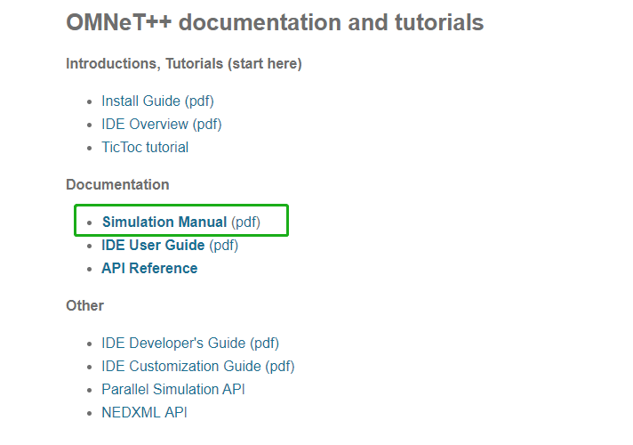
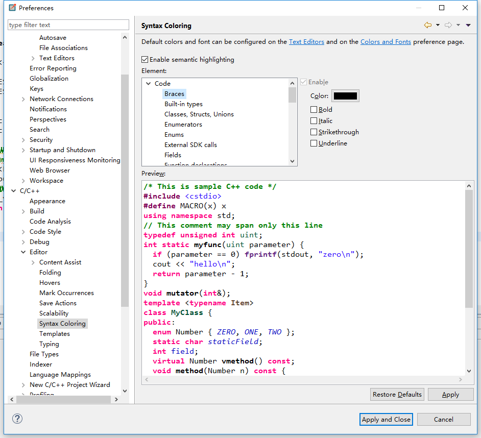
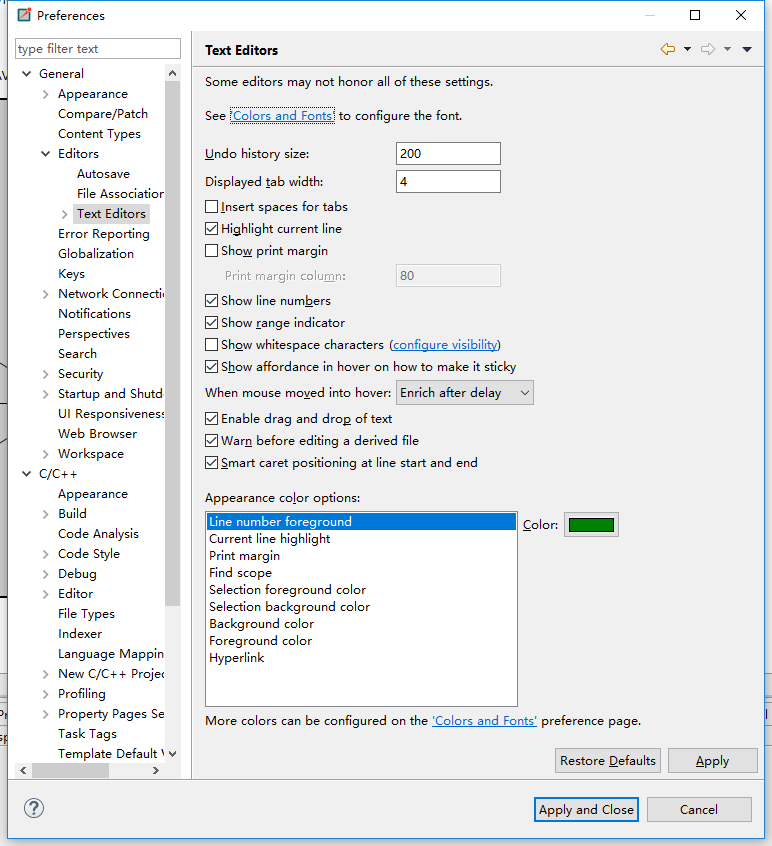

# OMNeT++指南 #

欢迎来到第三章，本章主要介绍**OMNeT++**官方已经提供的学习资料有哪些，并以**OMNeT++**内一系类**tictoc**作为实例进行简单的设计说明，通过本章你可以快速的了解到如何学习**OMNeT++**、掌握官方的学习资料和利用**OMNeT++**可以做哪些事情。

## 学习map ##

就目前学习**OMNeT++**的资料来说，网上的资料有：

- [1] 《OMNeT++中文使用手册》

- [2] 《OMNeT++与网络仿真》

- [3] 《OMNeT++网络仿真》

目前较全的资料就上面三种，其中前两种参考价值比较好一些，其中第一本就是**OMNeT++**官方提供的资料的翻译版，主要介绍范范的仿真程序设计，不能称其为学习教程，应该叫参考资料。第二本《OMNeT++与网络仿真》与第一本相比，在仿真程序的设计时更有价值一些，对部分函数接口有介绍，但是没有给出使用场景。其实到目前，作者认为还是官方提供的入门手册对初学者较友好一些，但是问题在于初学的时候我们不知道它的存在，包括我在初学的时候也是恍恍惚惚的，为了使读者在初学的时候就更好的利用这些资料，我在这里总结出官方到底提供了哪些资料。

### OMNeT++文档与指导书 ###

在**OMNeT++**安装路径下，官方提供了较多的使用指南，大多数以网页的形式给出。第一个要介绍的就是包括安装手册在内的多个文档入口：

- **路径：omnetpp-5.2/doc/index.html**

其内容包括从软件安装、初学Tictoc多个仿真例子、API参考到提升篇：IDE自定义指南和并行仿真指南等，详细如下：

**指导手册**

- 安装指导
- IDE 浏览
- TicToc指导手册

**文档**

- 仿真手册
- IDE用户指南
- API参考书

**其他**

- IDE开发者指导
- IDE自定义指南
- 并行仿真指南
- NEDXML接口函数

这里都是以中文的形式展现出官方提供的资料目录，而原目录都是以英文的形式给出。

### tictoc指导手册 ###

**tictoc**相当于程序中的**hello world**级别的例子，初学**OMNeT++**一般通过仿真修改**tictoc**例子，其路径在软件的安装路径下，点击该路径下的**index.html**：

- **路径：omnetpp-5.2/doc/tictoc-tutorial/index.html**

包括的内容如下：

- 开始：一个简单的仿真模型（**tictoc1.ned txc1.cc omnetpp.ini**）
- 仿真程序的执行和仿真
- 改进两个节点仿真模型（**tictoc9.ned txc9.cc omnetpp.ini**）
- 一个复杂的网络（**tictoc13.ned, tictoc13.msg, txc13.cc, omnetpp.ini**）
- 如何添加统计量（**tictoc17.ned, tictoc17.msg, txc17.cc, omnetpp.ini**）
- 如何可视化观察仿真结果
- 如何添加参数 （**在omnetpp.ini中配置.ned文件需要的参数**）

对于以上资料是目前入学**OMNeT++**较全系统的资料，从工程搭建、调试到添加统计量这些都是实际的网络仿真程序中一般会用到的，比如统计量，一般在网络中包括端到端延迟、入队排队时间、丢包数等。最后的仿真结果可视化观察，**OMNeT++**仿真程序结束后，在out文件下会生成仿真结果文件，**OMNeT++**提供可视化工具观察程序中统计的变量，可以转换成直方图和折线图，在后续会详细说明如何使用**OMNeT++**提供的观察和分析仿真结果工具。

### 仿真手册 ###

官方也提供了一个较详细的仿真手册，这里还是介绍一下这个手册。

- **路径：omnetpp-5.2/doc/manual/index.html**

入口如下（绿色部分标出）

 Simulation Manual仿真手册提供了设计一个**OMNeT++**工程各方面详细的介绍，从某种意义上来说，本手册也许就是Simulation Manual手册的一个子集，但是为了使本手册的意义更大，我将结合自己的几个月使用**OMNeT++**的经验，提供一些在设计网络时可能会出现的问题，以及解决办法。

## 个性化IDE ##

 添加这一节，只是个人乐趣而已，我曾经修改代码高亮花了一个下午的时间，每次总是很难找到相关的设置地方，只能说**OMNeT++**代码高亮设置放置的太隐秘了，到目前为止，我还是不能找到修改**.ned**文件的高亮设置（似乎没有这个功能）。相关**.cc**文件的设置地方下面会简单指明，其他更为详细的内容需要读者自行发挥。

### CPP高亮设置 ###

首先，进入到**IDE**设置界面：**Window 》》 Preferences**，如图：

从上图也可以看出，我们需要选择**c/c++》》Editor》》Syntax Coloring**，根据图中的窗口选择我们需要修改的高亮块设置。其中包括以下五种：

- Code:代码块
- Assembly: 汇编块
- Comments: 注释块
- Preprocessor: 预处理器块
- Doxygen: 其他

你可以根据自己的爱好选择不同的块设置，可选择颜色、加粗、斜体或者下划线等。

### 其他设置 ###

#### 显示行号 ####

在**OMNeT++**下默认没有显示行号的，但是毕竟有这个毛病，不显示行号就写不下去程序。 
如下图所示：

在这一界面中，我们**Tab**键宽度、显示行号或者当前行背景,其他设置读者可自行编辑看看。

## 本章小结 ##

**OMNeT++**仿真平台基于Eclipse，相关编译、工程设置与其他软件不同，且难找，本章列出仿真时读者可能需要用到的相关设置。
