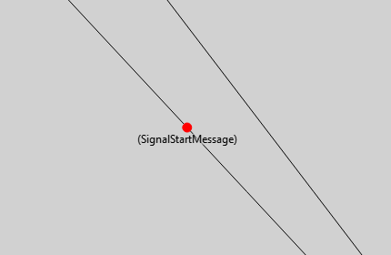
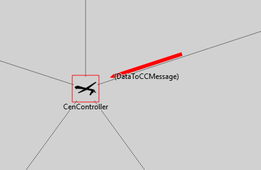
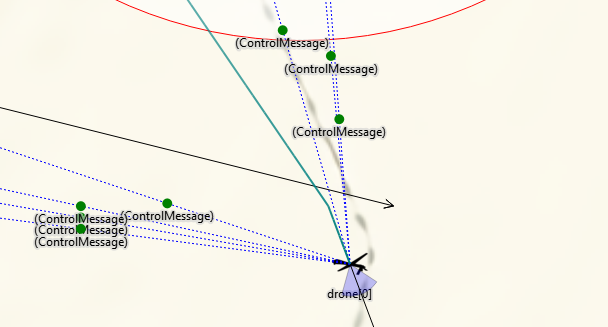

# OMNeT++仿真技巧 #

欢迎读者来到第五章的学习，本章打算从工程应用的角度，结合现有的仿真经验分享一些技巧，用套路二字来形容也不为过。</br>
本章涉及的内容包括信道模型应用、节点分布相关、节点之间如何建立通信以及门向量的相关设置，同时也会涉及以上代码相关的说明，简而言之，本章采用情景分析的方法进行说明。也许你会发现本章好多内容可以在<b>OMNeT++</b>社区提供的<b>Simulation Manual</b>手册中发现，所以推荐读者后续再阅读<b>Simulation Manual</b>手册进行深度研究。

## 设计技巧 ##

### 技巧一：信道模型很重要 ###

 据说理想的运放可以摧毁整个地球，那么是不是理想的充电宝是不是充不满电，偏题了，那么理想的信道呢？当初初次使用<b>OMNeT++</b>时，遇到一个问题：

- >在节点之间传输消息的时候，如何加快消息的传输速度？当节点数量较大的时候，需要较快的实现消息传送的效果。

有此疑问是在运行社区提供的相关工程时发现在他们的的仿真场景中，两个节点似乎可以同时发送消息出去，给人一种并行运行的感觉，让我不得不怀疑是不是需要调用并行接口才能达到这种效果，并且也发现他们的仿真程序运行时间特别小，换句话说就是接近现实的时间级，而我的仿真程序中两个节点传输一个消息都到秒级了，问题很大。</br>
最后发现这个问题与信道模型有关，也与下一小节的<b>send</b>函数相关。在<b>OMNeT++</b>中仿真的时候，如果没有添加信道模型，消息在两个节点之间传输线就是理想的信道模型，这个仿真信道会影响什么呢？

- 仿真结果
- 仿真现象

影响仿真结果好理解，仿真现象呢，那我们来看看仿真模型：

```C++
channel Channel extends DatarateChannel
{
    delay = default(uniform(20ns, 100ns));
    datarate = default(1000Mbps);
}
```

以上代码是一个简单的信道模型，将这个信道加入到传输线上将会有意想不到的效果。

### 技巧二：send函数有套路 ###

不知道读者有时候有没有感觉到<b>send</b>函数很麻烦，<b>send</b>函数用于两个模块之间的消息传输，但是当我们需要发送多条消息的时候，我们不能使用<b>for</b>循环直接就上，其主要原因就上我们使用<b>send</b>函数发送的消息还没有到达目的节点，此时我们不能使用<b>send</b>函数发送下一条消息，那么怎么办呢？这里有两种方案：

- 利用<b>scheduleAt</b>函数

```C++
void Node::handleMessage(cMessage* msg)
{
    if(msg->isSelfMessage()){
        if(msg->getKind()==SMSG_INIT){
                ...
                ...
            cMessage* cloudMsg = new cMessage("hello");
            cloudMsg->setKind(SMSG_INIT);//设置节点类型
            scheduleAt(simTime()+0.01,cloudMsg); //调度一个事件，发送消息给自己
        }
    }
}
```

通过使用<b>scheduleAt</b>函数使仿真时间走动，完成上一个消息的完成，这里补充一点，如果读者想使用延时来等待消息传输完成是不可行的，因为使用这种方法仿真时间是不会走动的。例如下面一段代码：

```C++
time1 = simTime();
func();
time2 = simTime();
```

在上面这段代码中我们的使用<b>func</b>函数想使时间走动，但是实验结果告诉我们：
$time1==time2$，
经过多次多个地方验证，发现在<b>OMNeT++</b>中如果不调用与仿真时间相关的函数，仿真时间是不会走动的，与上面的实验现象是一致的。因此为了实现仿真时间的走动我们可以采用上面<b>scheduleAt</b>函数自我调度一个时间然后再发送下一个消息。

- 一定要采用<b>send</b>函数呢？

上述采用<b>scheduleAt</b>的方法太麻烦，需要**new**一个消息，然后还需要定义一个<b>SMSG_INIT</b>，另外无端增多<b>handleMessage</b>函数内容，这种方法的确不是特别简洁。这里再分享另一种方法：

```C++
cPacket *pkt = ...; // packet to be transmitted
cChannel *txChannel = gate("out")->getTransmissionChannel();
simtime_t txFinishTime = txChannel->getTransmissionFinishTime();
if (txFinishTime <= simTime())
{
    // channel free; send out packet immediately
    send(pkt, "out");
}
else
{
    // store packet and schedule timer; when the timer expires,
    // the packet should be removed from the queue and sent out
    txQueue.insert(pkt);
    scheduleAt(txFinishTime, endTxMsg);
}

```

上面的代码用于通过<b>out</b>门发送一个<b>pkt</b>包，但是在传输前需要得到该门上传输的消息的完成时间，需要注意的是当<b>txFinishTime</b>为<b>-1</b>时，说明该门没有消息传输，可以直接发送，如果<b>txFinishTime</b>为一个大于0的值，说明有消息正在传输，需要等待。所以在判断时我们采用$txFinishTime <= simTime()$。</br>
通过这种方式，我们可以在<b>for</b>循环中发送多个消息。但是对于有些需求不得不使用<b>scheduleAt</b>函数完成。

- 提一提<b>sendDirect</b>函数！

```C++
sendDirect(cMessage *msg, cModule *mod, int gateId)
sendDirect(cMessage *msg, cModule *mod, const char *gateName, int index=-1)
sendDirect(cMessage *msg, cGate *gate)

sendDirect(cMessage *msg, simtime_t propagationDelay, simtime_t duration,
           cModule *mod, int gateId)
sendDirect(cMessage *msg, simtime_t propagationDelay, simtime_t duration,
           cModule *mod, const char *gateName, int index=-1)
sendDirect(cMessage *msg, simtime_t propagationDelay, simtime_t duration,
           cGate *gate)
```

对于其他<b>send</b>类似的函数都是有线的传输方式，需要我们将节点连接才能发送消息，那么如何实现无线的发送方式呢？这个也正是<b>OMNeT++</b>中<b>wireless</b>仿真程序中使用的函数，该函数的参数与其他<b>send</b>函数不同，它需要指定目的节点，以及目的节点的门。相关详细可以阅读<b>INET</b>库代码。</br>
这里有一个问题，当采用前三个函数进行消息传输时，传输的效果为一个圆点，如图**5-1**所示：



如果在设计网络时，需要将包传输效果设置成图<b>5-2</b>所示，对于有线连接和无线连接的两个节点方法不同，对于有线连接的<b>send</b>函数无法在函数的参数上设置。需要在网络拓扑连接时设置好信道，如代码段<b>5-1</b>所示：

```C++
channel Channel extends DatarateChannel
{
    delay = default(uniform(20ns, 100ns));
    datarate = default(2000Mbps);
}

```

对于无线连接的<b>sendDirect</b>函数，要想达到相同的效果，就没有设置<b>channel</b>一说了，在使用<b>sendDirect</b>函数时，有三个重载函数包括有两个参数<b>simtime_t propagationDelay/simtime_t duration</b>，一个是传播延时时间和持续时间，通过设置这两个参数可以达到图<b>5-2</b>的效果。



### 技巧三：如何访问同一级的其他模块 ###

在设计网络拓扑时，我们有时需要在一个模块中直接访问同一级其他模块的相关参数，不再经过消息之间传输进行传输。这种接口在<b>OMNeT++</b>下也被提供了，如下一个代码示例：

```C++
cModule *parent = getParentModule();

// 取出父模块下的beBuffer模块
cModule *psubmodBE = parent->getSubmodule("beBuffer");
BEBuffer *pBEBuffer = check_and_cast<BEBuffer *>(psubmodBE);

cModule *psubmodRC = NULL;
RCBuffer *pRCBuffer = NULL;
// 取出父模块下的rcBuffer模块
psubmodRC = parent->getSubmodule("rcBuffer");
pRCBuffer = check_and_cast<RCBuffer *>(psubmodRC);

```

上面的代码片段主要通过<b>getParentModule</b>和<b>getSubmodule</b>两个接口得到指向目的模块的指针，得到指针相当于我们拿到了这个目的模块的所有，需要注意的是这种方式的前提是目的模块是一个简单模块，需要与复合模块区分开，在<b>OMNeT++</b>中复合模块只有对应的**.ned**文件，其描述方式如下：

```C++
module Node{
        parameters:
    	...
	gates:
	...
}
```

而简单模块有三个文件：**.nde、.cc、.h**，其<b>.ned</b>文件中描述方式如下：

```C++
simple Node{
	parameters:
    	...
	gates:
	...
}
```

因此对于没有<b>.cc/.h</b>文件的复合模块，在编写代码时就没有对应的<b>C++</b>类，因此使用上述方法就出现问题，无法事先知道指针类型，那么对于复合模块的访问，我们可以通过下面的代码实现：

```C++
// 得到当前父模块下的所以模块
for(cModule::SubmoduleIterator iter(getParentModule()); !iter.end(); iter++){
        string ES = string("ES");
        cModule *submodule = *iter;
        string ESnode = string(submodule->getFullName(),0,2);
        // 判断是否是ES节点
        if(ESnode == ES){
                // 访问父模块参数
                string realname = string(submodule->getFullName());
                EScpu += submodule->par("cpu").longValue();
                ESmem += submodule->par("mem").longValue();

                cout<<EScpu<<" "<<ESmem<<endl;
        }
        else{
                continue;
        }
}
```

上面的代码段涉及到了<b>OMNeT++</b>下的<b>SubmoduleIterator</b>迭代器，该迭代器在较多的库中都有使用，比如：<b>INET</b>，当然这种方式可以经过简单的修改也可以对简单的模块进行访问。在上面的代码段中，<b>getParentModule()</b>指明是当前模块的父模块，该代码目的就是在当前简单模块中，得到同一父模块下的<b>ES</b>复合模块的<b>cpu/mem</b>两个参数。

### 技巧四：遍历所有模块 ###

在有些场景下，我们需要遍历所有节点，甚至是复合节点内部的模块，代码示例如下：

```C++
/*
 * 在所有节点中寻找一个ID 等于当前模块的headId号的模块
 */
void Node::doNext()
{
    cModule *parent = getParentModule();
    cModule *mod,*Head,*midmod;

    /* 网络中的所有节点都遍历一次，包括复合模块下的子模块 */
    for(int i=1;i<=cSimulation::getActiveSimulation()->getLastComponentId();i++){
        int number_of_Bees = cSimulation::getActiveSimulation()->getLastComponentId();
        cSimulation *simobj = cSimulation::getActiveSimulation();
        /* TODO优化 */
        mod = cSimulation::getActiveSimulation()->getModule(i);
        if(strcmp(mod->getName(),"CenController") == 0){
            /* 如果遍历到一个模块名为CenController的节点 */
            continue;
        }
        else{
            int j=0;
            while(1){
                string modname = cSimulation::getActiveSimulation()->getModule(i)->getName();
                midmod=cSimulation::getActiveSimulation()->getModule(i);
                Head=midmod->getSubmodule(this->clustername.c_str(),j)->getSubmodule("Wireless");
                if(((Node*)Head)->myId == this->headId){
                    /* 找到簇头节点,退出while循环 */
                    break;
                }
                j++;
            }
            // 在到满足条件的Head节点，开始执行相关操作
            ...
            ...
            ...
            break;
        }
    }
}
```

在上面的代码段中，可能有些诸如**Wireless**相关的过程与我实验源代码本身功能相关，本例只提供一种可参考的代码，具体运用于读者自己的项目中还需要做部分修改。为了让读者更快的掌握这种方法，下面就代码段中的重要接口做一个简单的分析：

- **for(int i=1;i<=cSimulation::getActiveSimulation()->getLastComponentId();i++)**</br>

这一句<b>for</b>循环遍历当前网络场景中的模块，只遍历仿真场景中的节点，不包括节点内部的模块，下面结合一个网络拓扑文件说明：

```C++
network simplenet
{
    parameters:
        ...
        ...
    submodules:

        node1[x]: typeA {
            parameters:
                ...
        }

        node2[y]: typeB{
            parameters:
                ...
        }

        node3[z]: typeD {
            parameters:
                ...
        }

    connections allowunconnected:
        ...
        ...
}

```

对于上述网络拓扑，使用上面的<b>for</b>循环只能遍历<b>node1/node2/node3</b>，对于它们内部的子模块不在其内。当最终需要寻找的模块是其中一个的子模块，需要先遍历父模块，然后使用<b>getSubmodule</b>函数遍历子模块。

- <b>midmod = cSimulation::getActiveSimulation()->getModule(i)</b>

紧接着上面的<b>for</b>循环，得到第**i**个模块的地址，如果该模块在网络中描述是用向量的方式需要使用：$$getSubmodule(“node_name”,j)$$，即可得到<b>node_name[j]</b>所代表的模块。

- <b>getSubmodule("modname")</b>

该接口似乎使用频率较高，如何得到一个复合模块的指针，即可通过该接口得到内部子模块的指针，然后访问相关数据。

### 技巧五：如何得到某一个模块引用的ned路径 ###

为什么需要在一个程序中得到该<b>"ned"</b>引用的路径呢？因为在<b>OMNeT++</b>中，我们在设计一个复合模块的内部结构时，可以直接采用图形的方式编辑，相当于我们可以直接拖动设计好的简单模块到复合模块中，而有些简单模块在不同的复合模块中其功能还有所不同，因此在为该简单模块编写<b>cc</b>文件时，我们需要检测一下当前本模块在什么模块下使用的，比如是在端系统还是交换机。得到一个模块的引用路径，其实就是一个接口函数的事，如下代码段：

```C++
cModule *parent = getParentModule();
const char *name = parent->getNedTypeName();

if (strcmp(name, "SimpleNetwork.Node.SimpleNode") == 0){
    cGate *outgate = gate("line$o");
    cChannel *chan = outgate->findTransmissionChannel();
    linkspeed = chan->getNominalDatarate();

}
else if (strcmp(name, "SimpleNetwork.Switch.SwitchPort") == 0){
    //int id = parent->findGate("line$o");
    cGate *outgate = parent->gate("line$o");
    cChannel *chan = outgate->findTransmissionChannel();
    linkspeed = chan->getNominalDatarate();
}

```

该接口函数便是**getNedTypeName**，得到完整的路径后，使用**c**库函数**strcmp**进行判断即可。

### 技巧六：使用cTopology类遍历拓扑初始化路由表 ###

这是个好东西，其实在**OMNeT++**中其实提供的大量的接口函数，只是在不知道的前提下写相似的功能函数比较麻烦，这个接口函数完美解决我们寻找路由的门问题，在使用**send**函数传输消息的时候只要知道我们传输的目的节点便可，直接利用一个路由表即可，代码示例如下：

```C++
/*
 * 探测交换机网络的拓扑
 */
void Router::TopoFind()
{
    cTopology *topo = new cTopology("topo");

    topo->extractByNedTypeName(cStringTokenizer("SimpleNetwork.Node.SimpleNode SimpleNetwork.Switch.SimpleSwitch").asVector());

    EV << "cTopology found " << topo->getNumNodes() << " nodes\n";

    //得到表示本节点的对象
    cTopology::Node *thisNode = topo->getNodeFor(getParentModule());

    // find and store next hops
    for (int i = 0; i < topo->getNumNodes(); i++){
        if (topo->getNode(i) == thisNode)
            continue; // skip ourselves
        //采用迪杰斯特拉算法计算到节点i的最短距离
        topo->calculateUnweightedSingleShortestPathsTo(topo->getNode(i));
        //本节点与外界连接的通道
        if (thisNode->getNumPaths() == 0)
            continue; // not connected

        cGate *parentModuleGate = thisNode->getPath(0)->getLocalGate();
        int gateIndex = parentModuleGate->getIndex();
        int address = topo->getNode(i)->getModule()->par("address");
        rtable[address] = gateIndex;
        EV << "  towards address " << address << " gateIndex is " << gateIndex  << endl;
    }
    delete topo;
}

```

该函数有三个比较重要的步骤：

- [1] **extractByNedTypeName**

为了得到一个路由表，我们需要指明需要遍历的节点类型。该函数便是指明遍历哪些节点。

- [2] **calculateUnweightedSingleShortestPathsTo**

得到路由表也涉及到路由算法的选择，在**ctopology.h**文件中有以下两个路由算法可供选择：

```C++
/** @name Algorithms to find shortest paths. */
/*
* To be implemented:
*    -  void unweightedMultiShortestPathsTo(Node *target);
*    -  void weightedMultiShortestPathsTo(Node *target);
*/

//@{

/**
* Apply the Dijkstra algorithm to find all shortest paths to the given
* graph node. The paths found can be extracted via Node's methods.
*/
virtual void calculateUnweightedSingleShortestPathsTo(Node *target);

/**
* Apply the Dijkstra algorithm to find all shortest paths to the given
* graph node. The paths found can be extracted via Node's methods.
* Uses weights in nodes and links.
*/
virtual void calculateWeightedSingleShortestPathsTo(Node *target);

```

代入参数就是目的节点地址，其他内容读者可自行探索。

- [3] **topo->getNode(i)->getModule()->par("address");**

这里比较重要的便是<b>“address”</b>形参，在以太网中相当于**IP**地址，最终得到的<b>rtable[]</b>表其索引就是目的地址的<b>address</b>，索引对应的值就是该节点的门，从该门出去到目的节点路径最短。

### 技巧七：如何使用OpenSceneGraph ###

其实在<b>OMNeT++</b>中是可以直接使用<b>OpenSceneGraph</b>的，可怜的我尝试了安装了一下午，才知道<b>OMNet++</b>已经支持<b>OpenSceneGraph</b>了，以后补充这一点可以看：

>omnetpp-5.2/doc/manual/index.html#sec:graphics:opp-api-for-osg </br>

 <b>samples</b>里已经有支持三维显示的仿真程序了，读者可自行运行看。

### 技巧八：如何多次利用同一个<b>msg</b> ###

在<b>OMNeT++</b>中，凡是使用<b>scheduleAt</b>调度的消息属于<b>Self-Messages</b>，其作用是用在模块本身调度事件使用的。有时需要利用同一个msg，但是中间必须使用<b>cancelEvent</b>函数取消掉上次，如下片段：

```C++
//cMessage *msg
if (msg->isScheduled())
    cancelEvent(msg);
scheduleAt(simTime() + delay, msg);
```

该代码段没有什么特别大的功能，主要是重复利用已经定义好的<b>msg</b>变量。

### 技巧九：initialize函数的不同 #####

在每一个简单模块对应的<b>.cc/.h</b>文件中会有一个initialize函数，其功能是在仿真程序开始执行前将会执行的函数，与类的构造函数不同，引出的问题就是：
>如果在其他成员函数中给一个指针数组成员赋值，当离开这个函数后，该指针数组值将会回到原来的值，该函数赋的值没有任何作用，但是如果在initialize函数中初始化这个指针数组，将会达到我们想要的结果。

### 技巧十：如何从仿真场景读取节点坐标 ###

也许作者的用词不明，这里的仿真场景指的是运行仿真后出现的仿真界面。必须提到的是这个<b>OMNeT++</b>的仿真场景，节点在该场景上的位置，不一定是它的属性里边的地址，它们可以不同，感觉似乎是<b>OMNeT++</b>开发者提供的缺口，不知这个是好还是坏，但是好消息就是这些开发者提供了读取场景上节点属性的坐标和在程序中设置该坐标（目的就是让这个显示坐标更新），简而言之，你的节点坐标更新需要你自己在程序中完成，<b>OMNeT++</b>不会自动帮你完成。程序5.2.9-1是关于读取坐标和更新场景坐标的显示的代码段：

```C++
程序5.2.9-1
// 按照最开始的网络拓扑（按圆形分布），得到每一个节点的坐标
auto parentdispStr = parents->getDisplayString();
this->xpos = atof(parentdispStr.getTagArg("p", 0));
this->ypos = atof(parentdispStr.getTagArg("p", 1));

coord_X.setDoubleValue(this->xpos); //将仿真界面上的xpos改变
coord_Y.setDoubleValue(this->ypos); //将仿真界面上的ypos改变
```

需要再次提示的是这个坐标读取的是显示的节点的坐标，与节点在仿真场景上显示的位置可能没有关系。

对于一个复合模块中的一个简单节点想获符合节点中的坐标以及该节点的移动速度时，可以利用inet中自带的iMobility模块即可以实现完成。具体的实现程序如下所示：

```C++
程序5.2.9-1
// 按照最开始的网络拓扑（按圆形分布），得到每一个节点的坐标
cModule *temp_NodeModule=this->getParentModule();
inet::IMobility *node_Mobility=check_and_cast<IMobility *>(temp_NodeModule->getSubmodule("mobility"));
Coord coord_Node=node_Mobility->getCurrentPosition();//获取节点的位置
double NodeX=coord_Node.x;
double NodeY=coord_Node.y;
Coord speed_Node=node_Mobility->getCurrentVelocity();//获取节点的速度
double  NodeVv=speed_Node.x;
double NodeVy=speed_Node.y;
```


### 技巧十一：如何调用INET中的类 ###

有时候在仿真程序中有种需求：
>需要在一个仿真程序中调用其他库中的函数，例如需要使用<b>INET</b>中相关类，那这时候的逻辑是什么？

与在某一个工程下需要<b>import INET</b>中的NED模型，我们需要在工程的属性中<b>Project References</b>中勾上我们需要<b>import</b>的库，然后在工程的ned文件中添加ned模型路径。同时当我们设置了工程<b>Project References</b>，当编译该工程时，将会链接<b>Project References</b>中勾上的工程编译生成的库文件，其中涉及以下编译设置：

```C++
// macros needed for building Windows DLLs
#if defined(_WIN32)
#  define OPP_DLLEXPORT  __declspec(dllexport)
#  define OPP_DLLIMPORT  __declspec(dllimport)
#else
#  define OPP_DLLIMPORT
#  define OPP_DLLEXPORT
#endif

```

以上摘取自INET开源库中**platdefs.h**文件，其中比较重要的是当编译INET库时，编译默认选项会使用**__declspec(dllexport)**，当另一个仿真工程（使用了**INET**库中的类）编译时，将会以**__declspec(dllimport)**，因此工程不需要设置其他编译选项，但是需要将诸如**INET**编译生成的**dll**或者**a**拷贝一份到该工程目录下。

- 注意：

如果以上关系皆满足，再出现在链接工程的错误可能其其他导致的。

## 可视化接口 ##

### 设置消息传输颜色 ###

### 设置节点 ###

在设置节点前，先阅读以下代码：

```C++
this->getDisplayString().setTagArg("i",1,"red");
```

由以上代码函数名基本可以猜想到该行代码可能是设置显示相关标记，但具体设置哪一种标记可能需要知道**setTagArg()**函数的参数意义。其中**i**代表所设置**Tags**类型，在**OMNeT++**中**Tags**类型包括：

- p -- positioning and layout
- p -- positioning and layout
- b -- shape (box, oval, etc.)
- i -- icon
- is -- icon size
- i2 -- auxiliary or status icon
- r -- range indicator 
- q -- queue information text
- t -- text
- tt -- tooltip

所以，根据以上列表得知prog-5.x将设置图标相关属性，接下来我们需要知道紧接着的两个参数含义：

```c
@display("i=block/source,red,20")
```

从**ned**文件中节点显示设置可以看出，属性**i**后第1个参数为**red**（从0开始数），那么prog-5.x便是将**i**后第**i**个参数设置为**red**，到这里我们对**setTagArg()**函数的使用便掌握了。

## 调试技巧 ##

### gdb调试 ###

OMNeT++支持gdb调试，与其他IDE调试方式相似，不同之处在于，若在网络仿真原型中设有统计参数，需在配置文件**omnetpp.ini**中设置：

```C++
check-signals = false
```

若仿真过程中，未关闭**check-signals**，调试过程将会发生统计参数内存分配问题。

### log日志类 ###

由于OMNeT++所提供**EV**显示信息在关闭仿真程序后，无法查看，可采用日志类将仿真信息打印到文本文件（亦可将**cout**重定向到文件）。在这里分享一个作者在调试OMNeT++仿真程序时编写的日志类**logging**。
使用方法如下：

```C++
/* 声明 */
using namespace logging

logger variablename("path to file","filename"); 

/* 使用 */
logger<<"current simulation time = "<<simTime()<<endl;
```

下载地址：[logging-class](https://github.com/wangrongwei/lazytools)

### 技巧十二：如何实现跨模块进行调用函数或参数 ###

在进行仿真的过程中，难免用到跨模块的函数调用或者参数调用，本部分主要对这部分进行简单的介绍：
其大致思路如下：
1）从复合模块中的一个简单模块退到该简单模块的上一层，也就是其父模块；

```C++
cModule *temp_Module=this->getParentModule();
```

2） 从父模块中找到你所要找到包含你需要的函数的子模块，也就是简单模块；

```C++
App *temp_mobility=check_and_cast<App *>(temp_Module->getSubmodule("app"));
/* App表示子模块的类名称 ，app表示你所需要的模块*/
```

3）找到你所需要的模块之后，然后就可以获得你所需要的函数或参数变量；

```C++
if(this->mClusterHead==app->myAddress){
    if(!app->mIsClusterHead){//这就是获得其他模块中的参数
        app->mIsClusterHead=true;
    }
}
```

### 技巧十三：如何实现节点消息的同时显示 ###

当一个节点对多个节点进行发送消息时，为了在视觉上看到消息同时从一个端口发出，只需要利用一个函数就可以解决：

```C++
simtime_t txFinishTime = gate("line$o")->getTransmissionChannel()->getTransmissionFinishTime();
if((txFinishTime == -1) || (txFinishTime < simTime())){
    //通过修改延迟可以使节点能够同时发送消息
    sendDirect(pk,0.001,0,allUAV[(int)pk->getDestAddr()],"port$i",address);
}
else{
        sendDirect(pk,txFinishTime-simTime(),0.5,allUAV[(int)pk->getDestAddr()],"port$i",address);
    }
```

需要注意该函数一定放在与外界相连接的简单模块，不然是看不到的；

最终的显示效果入下图所示：



## 本章小结 ##

**OMNeT++**仿真内核提供的丰富的仿真接口，使用**OMNeT++**进行仿真，在掌握一定的**C++**编程方法以后，阅读**OMNeT++**相关类的描述可能有意外的收获，找到合适的接口进行仿真。
